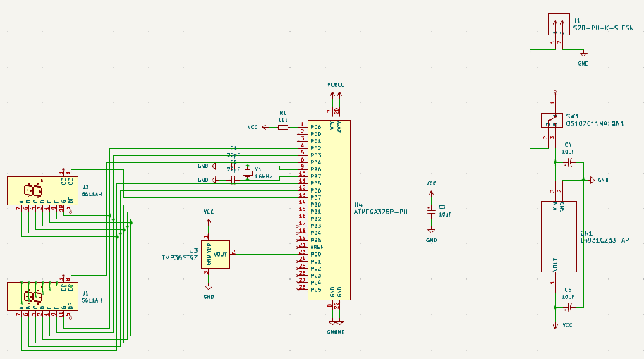
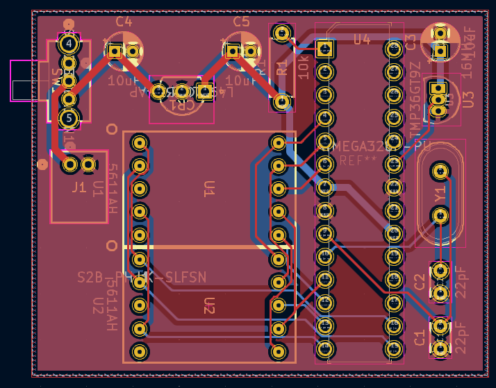
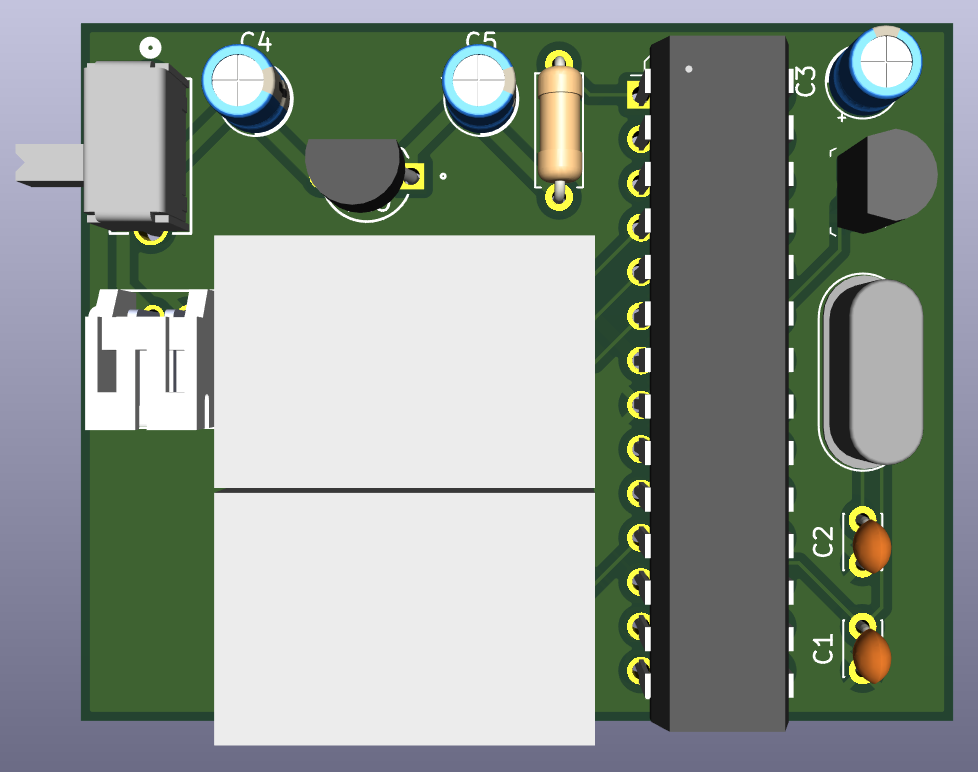
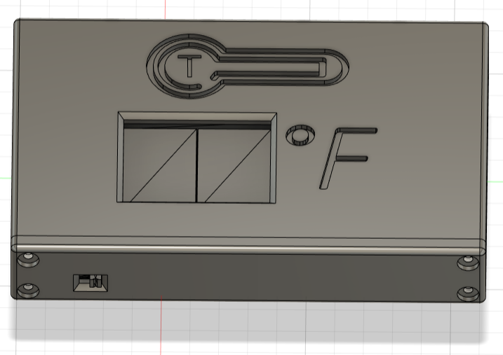
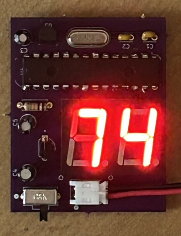

# ATmega328P Thermometer
This repository contains code, PCB, and enclosure design for a thermometer based on the ATmega328P microcontroller.

I was inspired to work on this project because of my lack of a portable, lightweight thermometer to take on hiking/camping trips. I've previously relied on my phone's weather app and woken up with a frost-covered sleeping bag as a result, so having a thermometer on hand is a useful tool for testing the efficacy of my sleep system.

The code was written  and tested in Arduino IDE.

Schematic and PCB were designed in KiCad.

Enclosure was designed in Fusion 360.

## List of Materials
* [ATmega328P-PU](https://www.digikey.com/en/products/detail/microchip-technology/ATMEGA328P-PU/1914589)
* [JST 2-pin Connector Header](https://www.digikey.com/en/products/detail/jst-sales-america-inc/S2B-PH-K-S/926626)
* [Lithium Ion Polymer Battery - 3.7v 500mAh](https://www.adafruit.com/product/1578)
* [Right Angle Slide Switch](https://www.digikey.com/en/products/detail/c-k/OS102011MA1QN1/1981430)
* [L4931CZ33-AP Voltage Regulator](https://www.digikey.com/en/products/detail/stmicroelectronics/L4931CZ33-AP/1038129)
* [16MHz Crystal Oscillator](https://www.sparkfun.com/products/536)
* 2x Single Digit 7-segment Display
* 3x 10uF Electrolytic Capacitor
* 2x 22pF Ceramic Capacitor
* 10k Ohm Resistor

## Schematic

## PCB

## 3D Model

## Enclosure

## Final Product - Without Enclosure

